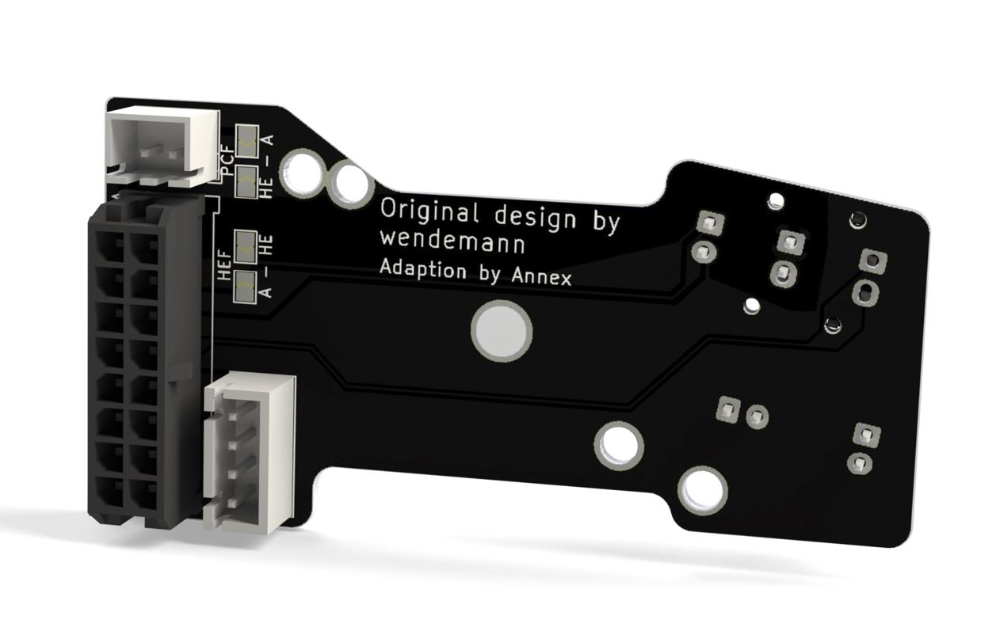
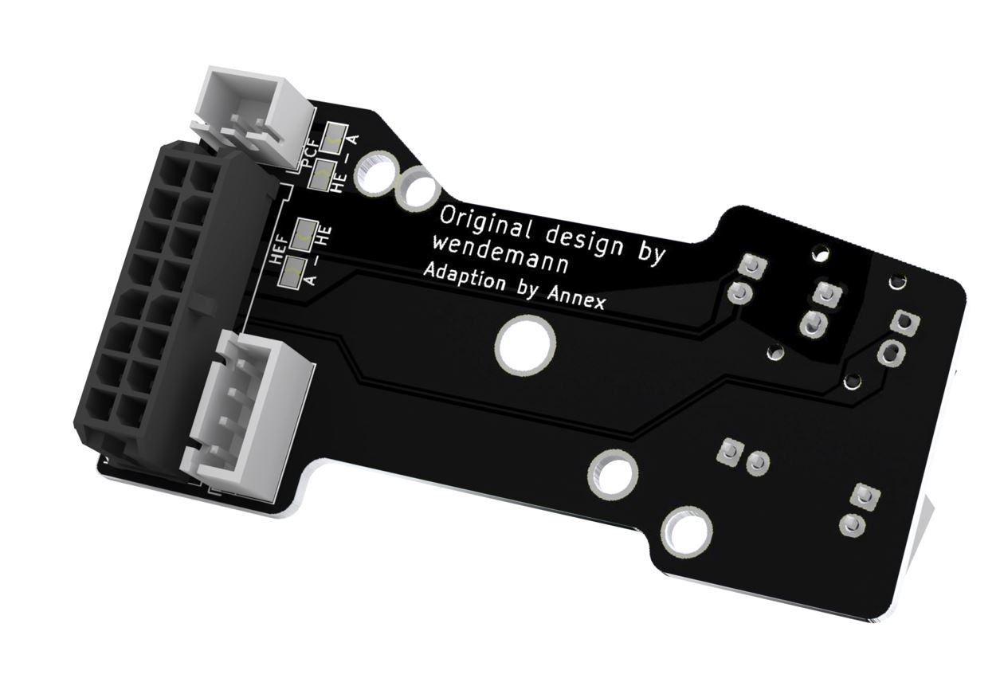
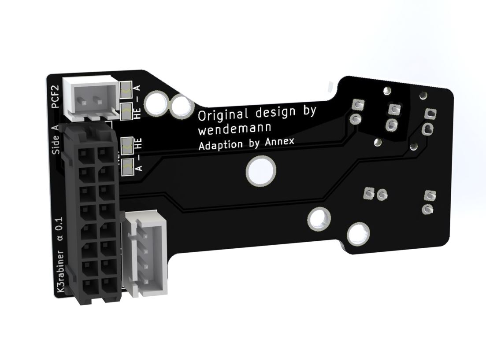

# K3rabiner-Toolboard

The K3rabiner is a customized toolboard for the K3 and an easy & quick connection between the backpack and toolhead. Thanks to wendemann for the original work & inspiration.

## Features

- Supports Sherpa Mini/Micro ONLY
- Input via 16pin horizontal microfit
- Output for partcooling fans
- Soldered seperate voltage selection for hotend fan and partcooling fan
   - Uses either the hotend voltage or one alternative voltage

## Connectors & Amperage

_Note: All amperage-values have been designed to work in an enclosed printer with up to 65° chamber temperature & have  some safety margins. While you could use higher ampere in an open-frame printer, it's highly discouraged.  
When multiple connectors are supported **bold** marks the recommended connector._

|   | Supported Connectors | Maximum Ampere |
| ------------- | ------------- | ------------- | 
| Hotend  | 2-pin JST XH   Microfit 430450227   **Microfit 436500227** (compatible with e3d heater) | ~2 Ampere (50W heater on 24V)   4.2 Ampere (100W heater on 24V)  4.2 Ampere (100W heater on 24V)
| Hotend Thermistor  | 2-pin JST XH   **Microfit 436500227** (compatible with e3d thermistor) | /   /
| Hotend Fan | 2-pin JST XH | 1 Ampere
| Partcooling Fan | 2-pin JST XH | 2 Ampere
| Stepper | 4-pin JST XH | 1.2 Ampere   0.84 Ampere on TMC drivers as you specify the RMS ampere which is ~70% of peak
| Aux / Probe | 4-pin JST XH | 0.8 Ampere

## BOM / Parts

Find the latest BOM in the [Annex Sourcing Guide](https://docs.google.com/spreadsheets/d/1O3eyVuQ6M4F03MJSDs4Z71_XyNjXL5HFTZr1jsaAtRc) under PCBs

## Revisions

The following revisions have been made to the K3rabiner.
This overview is non-exhaustive and does not cover all revisions that were previously released.

|Version|Changes|Known Bugs|
|:------|:-----|:---------|
|1.0|-|-|

## Build Guide

[Please check out this simple written build guide](buildguide/README.md).

## Wiring Guide

[Please refer to the pinout-section of the docs](../pinout/README.md)

## Gallery

