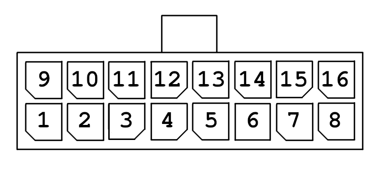

# Pinout

All carabiners (& derivatives) are using the official pinout for the carabiner.

We welcome other groups using the cable for their projects, but kindly ask to note in their project page if they are using the official carabiner pinout, to help prevent damage to users equipment, caused by different pinouts.

## Pinout

This pinout assumes you're looking directly at the cable. 

| PinNumber | Usage  | OnPCB | PinNumber | Usage | OnPCB | 
|-------------|:-------------:|:-------------:| ------------- |:-------------:|:-------------:|
| 1  |  Thermistor Chamber | ThChamb | 9 | Hotend Voltage | Main+
| 2  | Partcooling Fans Ground | PCF- | 10 | Hotend Ground | HE-
| 3  | Hotend Fan Ground | HEF- | 11 | Alt Voltage | Alt+
| 4  | Thermistor Common Ground | ThGnd | 12 | Thermistor Hotend | ThHE
| 5  | Motor A | 1A | 13 | Motor C | 2A
| 6  | Motor B | 1B | 14 | Motor D | 2B
| 7  | Aux 1 | A1 | 15 | Aux 2 | A2
| 8  | Aux 4 | A4 | 16 | Aux 3 | A3

## Recommended Wiregauge

While we have official cables available, we don't want to discourage people making their own cables, as such here is our recommended minimum wiregauge, for making a cable with the official pinout.
These recommendations assume the carabiner is being used in a 50° chamber.

| Pin-Number | Recommended AWG | Recommended mm² |
|:-----------:|:---------------:|:---------------:|
| 1 | 26 | 0.125 |
| 2 | 22 | 0.3 |
| 3 | 26 | 0.125 |
| 4 | 26 | 0.125 |
| 5 | 26 | 0.125 |
| 6 | 26 | 0.125 |
| 7 | 26 | 0.125 |
| 8 | 26 | 0.125 |
| 9 | 22 | 0.3 |
| 10 | 22 | 0.3 |
| 11 | 22 | 0.3 |
| 12 | 26 | 0.125 |
| 13 | 26 | 0.125 |
| 14 | 26 | 0.125 |
| 15 | 26 | 0.125 |
| 16 | 26 | 0.125 |
